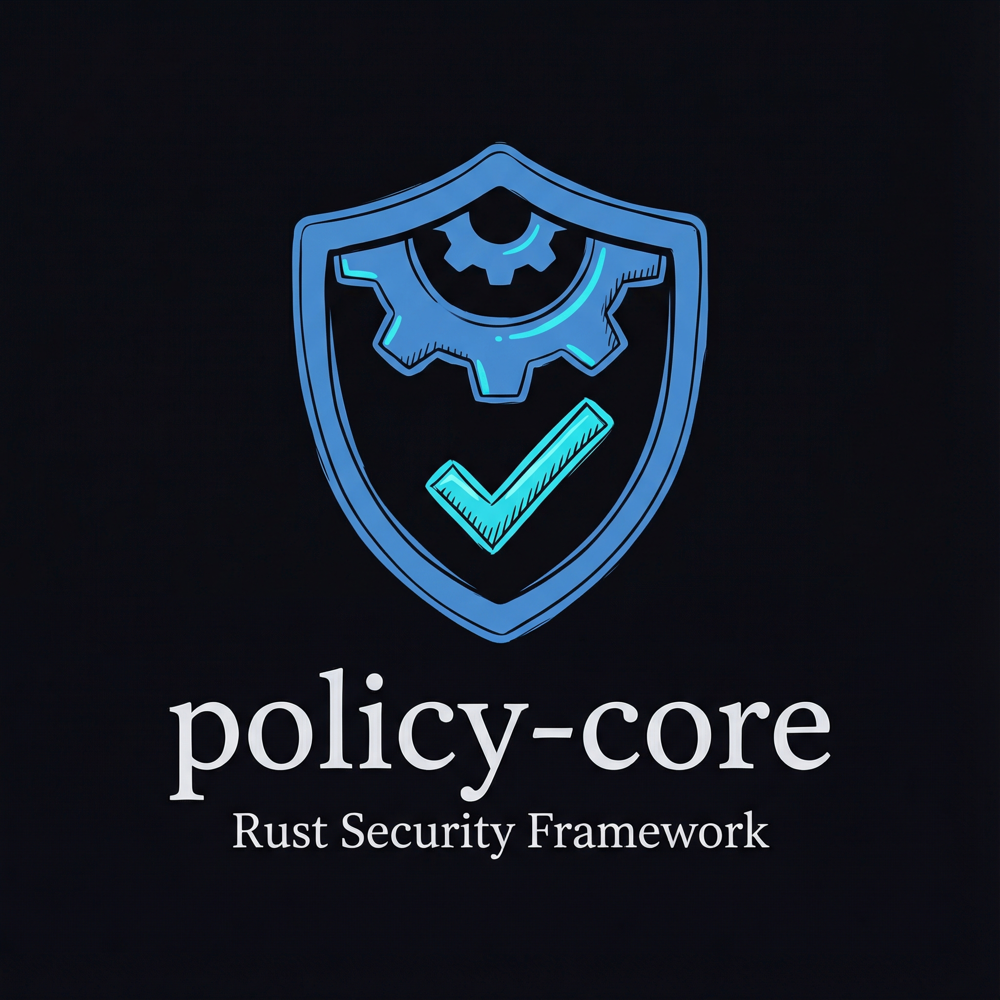
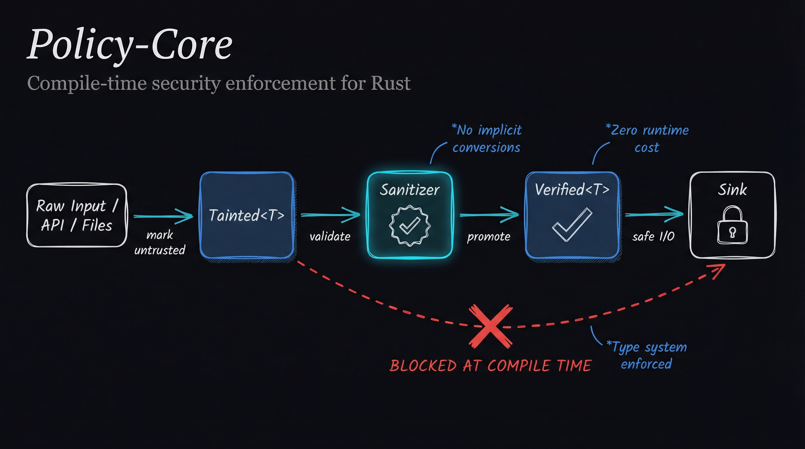

# Policy Core

> Compile-time policy enforcement and taint tracking for Rust.

[](https://opensource.org/licenses/MIT)
[](https://www.rust-lang.org)
[](https://crates.io/crates/policy-core)
[](https://docs.rs/policy-core)
[](https://github.com/camadkins/policy-core/actions)


## What is policy-core?

`policy-core` prevents injection attacks, unauthorized access, and accidental data leaks using Rust's type system. Untrusted input is wrapped in a `Tainted<T>` type with no public accessors. To perform side effects—logging, database writes, HTTP requests—the data must pass through a `Sanitizer` that validates it and returns `Verified<T>`. Sinks accept only `Verified<T>`, making compile-time bypass structurally impossible.



```text
Tainted<T> → Sanitizer → Verified<T> → Sink
```

## Key Features

- **Type-safe taint tracking** — Prevents injection attacks at compile time
- **Capability-based access control** — Unforgeable tokens gate logging, database, and HTTP operations
- **Zero-cost abstractions** — No runtime overhead; guarantees enforced by the type system
- **Type-state contexts** — Encode authentication and authorization state in types (`Ctx<Unauthed>` → `Ctx<Authed>` → `Ctx<Authorized>`)
- **Web framework integration** — Axum extractors and middleware for production use
- **Static analysis** — Custom Dylint lints enforce architectural invariants at compile time
- **No unsafe code** — Core abstractions built on safe Rust

## Installation

```bash
cargo add policy-core
```

## Quick Start

Here's a minimal example demonstrating taint tracking:

```rust
use policy_core::{Tainted, Sanitizer, StringSanitizer, Sink, VecSink};

fn main() -> Result<(), Box<dyn std::error::Error>> {
    // Step 1: Mark untrusted input as tainted
    let user_input = Tainted::new("  hello world  ".to_string());

    // Step 2: Sanitize with validation rules
    let sanitizer = StringSanitizer::new(256);
    let verified = sanitizer.sanitize(user_input)?;

    // Step 3: Pass verified data to sink
    let sink = VecSink::new();
    sink.sink(&verified)?;

    // Verify the result (trimmed whitespace)
    assert_eq!(sink.to_vec(), vec!["hello world"]);

    println!("Success! Input was validated and processed safely.");
    Ok(())
}
```

The type system prevents bypassing validation at compile time. Attempting to pass `Tainted<T>` directly to a sink results in a compile error. See the [`examples/`](examples/) directory for complete demonstrations.

## How It Works

```text
┌─────────────┐
│ Raw Input   │  (user form, API call, file)
└──────┬──────┘
       │
       ▼
┌─────────────────┐
│  Tainted<T>     │  Mark as untrusted at boundary
└──────┬──────────┘
       │
       ▼
┌─────────────────┐
│   Sanitizer     │  Validate according to policy
└──────┬──────────┘
       │
       ▼
┌─────────────────┐
│  Verified<T>    │  Guaranteed safe by construction
└──────┬──────────┘
       │
       ▼
┌─────────────────┐
│     Sink        │  Perform side effect
└─────────────────┘
```

**Key properties:**

* No implicit conversions bypass sanitization
* `Tainted<T>` to `Verified<T>` transition requires explicit validation
* Compile errors prevent accidental misuse
* Type invariants enforced through visibility (`pub(crate)` constructors)

## Core Concepts

### `Tainted<T>`

Marks data from untrusted sources (user input, network requests, files). The inner value is inaccessible:

* No `Deref`, `AsRef`, `From`, or `Into` implementations
* Inner field is private; only `pub(crate)` accessor exists
* Cannot be passed to sinks (compile error)

### `Sanitizer`

Validates and promotes tainted data to verified data:

```rust
pub trait Sanitizer<T> {
    fn sanitize(&self, input: Tainted<T>) -> Result<Verified<T>, SanitizationError>;
}
```

Implementations define validation rules and call `Verified::new_unchecked` only after validation succeeds. Errors do not leak rejected input.

The crate includes `StringSanitizer`, which trims whitespace, rejects control characters, and enforces length limits.

### `Verified<T>`

Data that has passed validation:

* No public constructor—only `pub(crate) fn new_unchecked`
* No `Deref`, `From`, `Into`, or `Default`
* Explicit accessors: `as_ref()` and `into_inner()`
* External code cannot create `Verified<T>` except through a `Sanitizer`

This creates a validation bottleneck: all paths from untrusted input to sinks must pass through explicit sanitization.

### `Sink`

Operations that perform side effects (writes, logs, network calls):

```rust
pub trait Sink<T> {
    fn sink(&self, value: &Verified<T>) -> Result<(), SinkError>;
}
```

By accepting only `&Verified<T>`, sinks reject `Tainted<T>` at compile time.

The crate includes `VecSink`, an in-memory sink for testing.

## Common Usage Patterns

These patterns demonstrate when and how to use policy-core's core abstractions. See the [`examples/`](examples/) directory for complete working code.

### Pattern: Working with Tainted Data

**When to use:** Mark all external input—user forms, API requests, file contents—as tainted at system boundaries.

**Key insight:** `Tainted<T>` prevents accidental use of unvalidated data. The type system forces explicit validation before sinks accept the data.

**Reference:** [`examples/basic_taint_flow.rs`](examples/basic_taint_flow.rs), integration tests in `tests/taint_tracking_test.rs`

### Pattern: Building Authorization Contexts

**When to use:** Create verified contexts that carry proof of authentication and authorization through your application.

**Key insight:** `PolicyGate` validates policies before constructing a `Ctx`. Operations requiring specific capabilities demand the corresponding `Ctx` state as a parameter.

**Reference:** [`examples/policy_gate_validation.rs`](examples/policy_gate_validation.rs)

### Pattern: Using Capabilities

**When to use:** Gate access to sensitive operations (logging, database writes, HTTP calls) behind unforgeable capability tokens.

**Key insight:** Capabilities have `pub(crate)` constructors. External code cannot forge them—they must be granted through policy validation.

**Reference:** [`examples/audit_trail.rs`](examples/audit_trail.rs)

For complete demonstrations of these patterns integrated together, see [`src/demo.rs`](src/demo.rs) and the full integration test suite.

## Example: End-to-End Flow

```rust
use policy_core::{Tainted, Sanitizer, StringSanitizer, Sink, VecSink};

// Step 1: Mark untrusted input as tainted
let user_input = Tainted::new("  hello world  ".to_string());

// Step 2: Sanitize with validation rules
let sanitizer = StringSanitizer::new(256);
let verified = sanitizer
    .sanitize(user_input)
    .expect("valid input passes");

// Step 3: Pass verified data to sink
let sink = VecSink::new();
sink.sink(&verified).expect("sink succeeds");

// Verify the side effect
assert_eq!(sink.to_vec(), vec!["hello world"]); // trimmed

// This does NOT compile (type error):
// let tainted = Tainted::new("unsafe".to_string());
// sink.sink(&tainted); // Expected &Verified<String>, got &Tainted<String>
```

The sanitizer trims whitespace, rejects empty strings, blocks control characters, and enforces length limits. Invalid input produces a `SanitizationError` without leaking the rejected value.

## Enforcement Pack (Static Analysis)

The `dylint/` directory contains custom Dylint lints that enforce architectural invariants at compile time.

**Purpose:** Prevent accidental bypass of capability gating, taint tracking, and explicit context patterns.

**Run locally:**

```bash
cargo install cargo-dylint dylint-link
cargo dylint --all --workspace
```

**CI:** Lints run automatically on every PR. Deny-level violations fail the build.

**Documentation:** See [`dylint/README.md`](dylint/README.md) for:
- Enforcement philosophy and scope
- Implemented lints and future work
- Suppression policy (strict, auditable exceptions only)
- Reviewer guidance for policy-affecting changes

## Dependencies

`policy-core` keeps dependencies minimal:

* **`tracing`** — Structured logging for policy decisions, sanitizer results, and sink activity. Does not affect type-level guarantees.

* **`tracing-subscriber`** — Test and demo support for log collection. Used to show how policy decisions surface in logs while keeping side effects in-memory.

Core types (`Tainted<T>`, `Verified<T>`, `Sanitizer`, `Sink`) depend only on the standard library. Logging is optional.

## Build Performance Tips

The project is configured with optimized build profiles for faster development iteration.

### Local Development Setup

For even faster builds, create `.cargo/config.toml` in the project root (this file is git-ignored):

```toml
[build]
# Use lld linker (faster than default ld)
rustflags = ["-C", "link-arg=-fuse-ld=lld"]

[target.x86_64-unknown-linux-gnu]
linker = "clang"
rustflags = ["-C", "link-arg=-fuse-ld=lld"]
```

### Install Faster Linker

#### lld (good, widely available)
```bash
sudo apt install lld clang  # Ubuntu/Debian
brew install llvm           # macOS
```

#### mold (best, Linux only)
```bash
# See: https://github.com/rui314/mold
# After installing, change rustflags to: ["-C", "link-arg=-fuse-ld=mold"]
```

### Build Profiles

- `cargo build` - Fast incremental builds (debug = 1, 20-30% faster than default)
- `cargo build --profile dev-opt` - Slightly optimized for performance testing
- `cargo build --release` - Full optimization
- `cargo test` - Fast test builds

The development profile uses `debug = 1` (line tables only) instead of `debug = 2` (full debug info), reducing build times by 20-30% with minimal impact on debugging capability. Release builds use thin LTO for optimal performance.

## Security Considerations

`policy-core` provides compile-time guarantees that prevent entire classes of vulnerabilities. However, like all security tools, it works best as part of a comprehensive defense strategy.

**Important Notes:**

* The included sanitizers provide reference implementations. Production systems should implement domain-specific validation logic tailored to their threat model.
* Type-level enforcement is strong but not absolute. Exercise standard precautions with `unsafe` code, deserialization, and FFI boundaries.
* This library complements—but does not replace—authentication, authorization, encryption, rate limiting, and other security fundamentals.
* Review your sanitizer implementations carefully. The type system enforces the *structure* of validation, not the *correctness* of validation logic.

For threat model details and best practices, see [SECURITY.md](SECURITY.md) and [DESIGN_PHILOSOPHY.md](DESIGN_PHILOSOPHY.md).

## Documentation

- **API Reference:** [docs.rs/policy-core](https://docs.rs/policy-core)
- **Examples:** [`examples/`](examples/) directory
- **Security Model:** [SECURITY.md](SECURITY.md)
- **Design Rationale:** [DESIGN_PHILOSOPHY.md](DESIGN_PHILOSOPHY.md)
- **Enforcement Pack:** [`dylint/README.md`](dylint/README.md)
- **Changelog:** [CHANGELOG.md](CHANGELOG.md)

## Versioning & Releases

This project follows [Semantic Versioning](https://semver.org/). See [crates.io/crates/policy-core](https://crates.io/crates/policy-core) for the latest stable version and [CHANGELOG.md](CHANGELOG.md) for release history.

**API Stability:** Starting with version 1.0.0, this crate follows strict [Semantic Versioning](https://semver.org/) (SemVer 2.0.0). Patch releases (1.0.x) contain bug fixes and documentation improvements only. Minor releases (1.x.0) add new features in a backwards-compatible manner. Major releases (2.0.0+) may include breaking changes to public APIs. All `pub` items are covered by stability guarantees.

## Contributing

Contributions are welcome! For significant changes, please open an issue first to discuss your approach.

**Before submitting a pull request:**

* Run quality checks: `cargo fmt`, `cargo clippy --all-targets --all-features -- -D warnings`, `cargo test --all-features`, `cargo test --doc --all-features`, `cargo dylint --all --workspace`
* Add tests for new functionality (sanitizers, sinks, capabilities)
* Update documentation to reflect behavior and guarantees
* Ensure changes align with the core philosophy: explicit policies, no implicit conversions, compile-time safety

See [DESIGN_PHILOSOPHY.md](DESIGN_PHILOSOPHY.md) for architectural principles.

## License

This project is licensed under the [MIT License](LICENSE).
